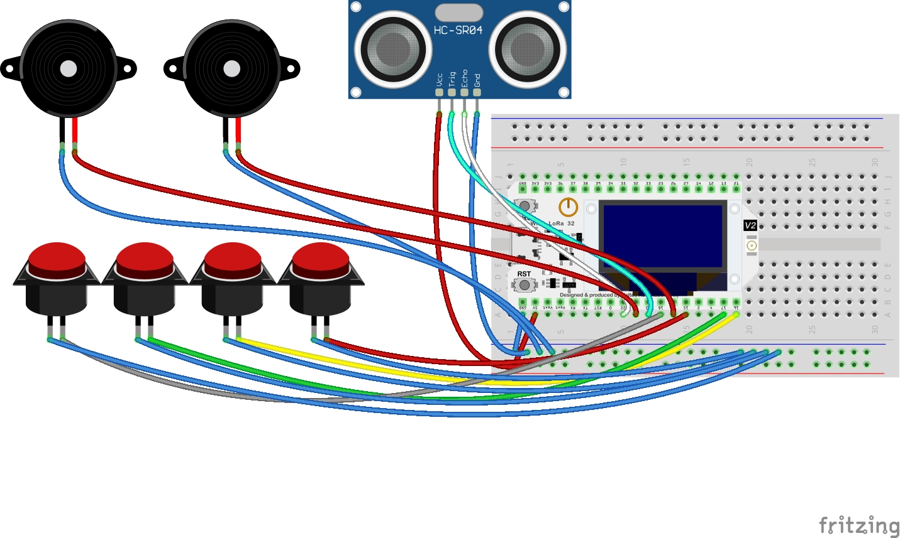

<div align="center">
   
   
   
</div>

**Truffictor** is an innovative research product that qualified as a finalist in the **Indonesian Student Research Olympiad Competition (OPSI)**. Truffictor aims to optimize truck driver safety with AI vision. This product is built using OpenCV, MediaPipe, and ESP32 DevKit.

## Key Features ⭐

- **Real-time Fatigue Detection:** Uses MediaPipe to track eye closure and facial landmarks.
- **IoT Integration:** Comunication between Python (AI) and ESP32 for instant alerts.
- **Auditory and Visual Warnings:** Activates buzzers and LED signals to wake the driver.
- **Visual Road Tracker:** Visualize the road markings and give alert if the truck escape from the path.

## Installation 🚀

### Prerequisites 🛠

- Python 3.7 - 3.12 (Latest version of Pyhton (3.13) is not officially supported by the standard MediaPipe package via PyPi)
- ESP32, Arduino (with WiFi built-in feature), Rasberry Pi, or other microcontroller
- Webcam
- Buzzer: 5V
- LED lamp (optional)
- Push button
- Bread board
- Jumper cable
- Ultrasonic sensor HC-SR04

_Note: If you don't have the hardwares included in prerequisites, you can skip **Step 2 & 3** and input a random ip after you run the python code._

### Step 1: Set Up Environment

1. Clone the Repository

```bash
git clone https://github.com/thheor/truffictor.git
cd truffictor
```

2. Set Up Environment (Optional)

```bash
python3 -m venv venv
source venv/bin/activate # On Linux or MacOs
venv\Scripts\activate # On Windows
```

If you are on Linux, you need to add  font in `venv/lib/python3.11/site-packages/cv2/qt/fonts/`.

3. Install Dependencies

```bash
pip install -r requirements.txt
```

_Note: If you are on Linux, you need to install `python3-tk` via your package manager_

### Step 2: Wiring Diagram

Pair ESP32 to bread board then connect all the components as per the following table.
| Components | Pin |
|------------|-----|
|Buzzer 1    |  5  |
|Buzzer 2    |  19  |
|Push button 1   |  15  |
|Push button 2    |  16  |
|Push button 3   |  17  |
|Push button 4   |  18  |
|Trig Pin   |  23  |
|Echo Pin   |  22  |

All negative pin of each components should be connected to GND. Your final diagram should look like this.



### Step 3: Set Up ESP32 Code

You can use any code editor, but I recommend using [Arduino IDE](https://www.arduino.cc/en/software/).

#### Quick Instructions

1. If this is the first time you are using ESP32, see [how to setup environment for ESP32 on Arduino IDE](https://esp32io.com/tutorials/esp32-software-installation)
2. Connect the ESP32 board to your PC via a micro USB cable
3. Open the code from **esp32kantuk.ino** on Arduino IDE on your PC
4. Select the right ESP32 board and COM port
5. Compile and upload code to ESP32 board by clicking **Upload** button on arrow right icon on top left corner
6. You will see the IP address of your ESP32 in Output section on Arduino IDE
7. Create a hotspot in your smartphone and update your ESP32 code to the name of SSID and the password you have made.

   | SSID      | Password   |
   | --------- | ---------- |
   | YOUR_SSID | YOUR_PASSWORD |


## 🖥 Execution

Open a terminal or command line in your PC and change the current directory to this project folder. Open with your favorite code editor (I use neovim btw). Run this following command.

```bash
python3 app.py
# or
python app.py
```

If you want to use your camera instead of using the given video assets, update the following code.

```python
def deteksi_kantuk(esp32_ip):
    cap = cv2.VideoCapture("./public/drowsiness.mp4") # Run with given assets 
    cap = cv2.VideoCapture(0) # Run with your camera 
    ...

def deteksi_hilang_kendali(video_path, esp32_ip):
    cap = cv2.VideoCapture(video_path) # Run with given assets
    cap = cv2.VideoCapture(0) # Run with your camera
    ...
```

The number `0` represents the ID of your camera. If you are using more than one camera, you must try one by one from number `0` to `number of camera - 1`.

---

Thank you for visiting -- Please leave a star ⭐ if you like!
